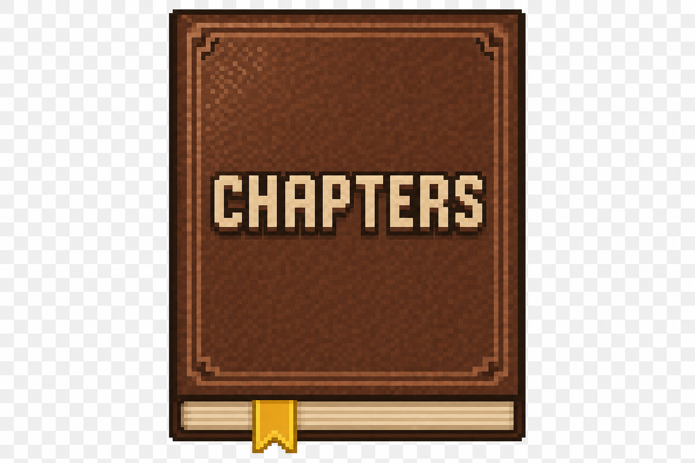

# Chapters (NeoForge 1.21.1)

<p align="center">
  
</p>

Chapters is a progression mod inspired by GameStages + ItemStages.

**Documentation (datapacks, KubeJS, examples, troubleshooting): [GitHub Wiki](https://github.com/GabinFqt/chapters/wiki)**

It lets you:
- lock items behind named stages
- lock fluids (tags, ids, whole mods) behind named stages
- lock Mekanism **chemicals** (unified gas / infusion / slurry / pigment registry) behind named stages when Mekanism is installed
- lock **recipes by id** behind named stages (datapack `recipes` array or KubeJS `recipe:…`; vanilla crafting-grid recipes are blocked server-side until unlocked; **JEI** hides those recipes by id across types)
- prevent pickup of locked items
- block crafting locked items **or** blocked recipe ids on the crafting grid
- auto-drop locked items from the player inventory (every second while online, and when a stage is removed or definitions reload)
- push client stage changes so **JEI** can hide locked entries (optional mod)

## Commands

- `/chapters add <player> <stage>`
- `/chapters remove <player> <stage>`
- `/chapters list <player>`
- `/chapters check <player> <stage>`
- `/chapters reload`

## Quick test (in-game)

The jar does **not** ship preset stages: add your own JSON under [`Datapack stages`](#datapack-stages); copy [`examples/datapack/tutorial`](examples/datapack/tutorial/) into `saves/<world>/datapacks/`; or copy [`examples/kubejs/`](examples/kubejs/) into your instance’s `kubejs/` folder (it registers `chapters:script_pickups` and related runtime stages).

With a datapack stage id like `myproject:tutorial` (file `data/myproject/chapters/stages/tutorial.json`):

1. `/reload`
2. `/chapters check Dev/myproject:tutorial`
3. `/give Dev minecraft:netherite_ingot 1` (if that item is gated in your JSON) → should be blocked until you `/chapters add Dev myproject:tutorial`

## Datapack stages

Put JSON files at:

`data/<namespace>/chapters/stages/<stage_id>.json`

Example:

```json
{
  "items": [
    "minecraft:netherite_ingot",
    "#minecraft:swords",
    "minecraft:enchanted_book"
  ],
  "fluids": [
    "minecraft:lava",
    "#minecraft:water",
    "@mymodfluids"
  ],
  "chemicals": [
    "mekanism:hydrogen",
    "#mekanism:gases",
    "@mekanism"
  ],
  "recipes": [
    "minecraft:diamond_pickaxe"
  ]
}
```

Rules:
- `items`: `#` prefixes are **item tags**; `@` prefixes lock every **item** in that namespace **and** every **fluid** and every **Mekanism chemical** in the same namespace (you can still use `fluid_namespaces` / `chemical_namespaces` for fluids-only or chemicals-only additions); other strings are item ids.
- Optional top-level `namespaces`: same as `@mod` entries — applies to **items, fluids, and Mekanism chemicals** together.
- Optional `fluid_namespaces`: **extra** namespaces that only affect fluids (additive).
- Optional `chemical_namespaces`: **extra** namespaces that only affect Mekanism chemicals (additive).
- Optional `fluids`: `#` prefixes are **fluid tags**; `@` prefixes are mods (every fluid in that namespace); other strings are fluid ids.
- Optional `chemicals` (Mekanism): `#` prefixes are **chemical tags** on Mekanism’s chemical registry; `@` prefixes are mods (every chemical in that namespace); other strings are chemical ids (e.g. `mekanism:hydrogen`).
- Optional `recipes`: list of recipe **holder** ids (`minecraft:diamond_pickaxe`, etc.—no `#`/`@`). Same stage rule as ingredients: locked until the player has at least one stage among all definitions listing that recipe. Enforced on the **vanilla crafting grid** (`CraftingMenu`); other workstations (smithing, machines) are **not** covered by that mixin yet—the recipe still hides in JEI when locked client-side.
- If an ingredient appears in any stage definition, a player needs at least one matching stage **among every definition that mentions that ingredient**: for items — use/pickup/crafting; for fluids — transferring with tanks or buckets/vanilla placement (NeoForge fluid util); for chemicals — Mekanism `ChemicalUtils` insert/extract paths when a **server player** is in scope (container slot handling) and the transfer is **not** `AutomationType.EXTERNAL` (tube/pipe automation is not gated the same way); for locked **recipe ids** — crafting-grid result for that recipe.

**Mekanism:** optional dependency; without Mekanism, `chemicals` / `chemical_namespaces` entries are accepted in JSON but build no index until the mod is present.

## KubeJS integration

Chapters registers a KubeJS plugin and bindings:

- `ChaptersEvents.defineStage(stageId, entries)` — `entries` must be a JS list (array) of item-style strings (`@mod` also locks that mod’s fluids and Mekanism chemicals), plus `fluid:…`, `chemical:…`, and `recipe:…` (holder id) overrides in the same list. Definitions are applied **once per server tick** after your script runs so many `defineStage` calls in one `ServerEvents.loaded` callback batch into a single reload (indices are rebuilt once).
- `PlayerStages.of(player).add(stageId)`
- `PlayerStages.of(player).remove(stageId)`
- `PlayerStages.of(player).has(stageId)`
- `PlayerStages.of(player).get()`

Example script:

```js
ServerEvents.loaded(event => {
  ChaptersEvents.defineStage(
    'mypack:tier1',
    [
      'minecraft:netherite_ingot',
      '#minecraft:swords',
      'recipe:minecraft:diamond_pickaxe'
    ]
  )
})

ServerEvents.commandRegistry(event => {
  // Example usage in your own command callbacks:
  // PlayerStages.of(player).add('mypack:tier1')
})
```

## Recipe viewer (JEI)

Chapters integrates optionally with **JEI**: when client stage payloads arrive, locked item / fluid / Mekanism chemical ids and locked **recipe ids** are recomputed: ingredients are hidden, output-focused recipes are hidden where applicable (Mekanism chemicals use `TYPE_CHEMICAL` when both mods are present), and recipes matching a locked id are hidden across JEI recipe types, with unlock reconciliation via `includeHidden()` on focus lookups.

## Development

Requirements:
- Java 21
- NeoForge 21.1.x

Build:

```bash
./gradlew build
```

Example KubeJS scripts for local testing live under [`examples/kubejs/`](examples/kubejs/) (copy into your instance’s `kubejs/` folder).

**Wiki sources** for the [GitHub Wiki](https://github.com/GabinFqt/chapters/wiki) live in [`wiki/`](wiki/). Maintainers: create the Wiki’s **first page** on GitHub if `*.wiki.git` is missing, then run `./scripts/publish-wiki.sh` (needs [`gh`](https://cli.github.com/) auth).

## Releases

Tag source releases as `v1.0`, `v1.1`, … matching `mod_version` in [`gradle.properties`](gradle.properties). Attach the built jar from `build/libs/` (after `./gradlew build`) to the GitHub Release.

### Publishing to Modrinth and CurseForge

Publishing is wired through the [`mod-publish-plugin`](https://modmuss50.github.io/mod-publish-plugin/). One-time setup:

1. Create the projects on [Modrinth](https://modrinth.com/dashboard/projects) and [CurseForge](https://authors.curseforge.com) (CurseForge requires manual approval before the first publish).
2. Fill in the project ids in [`gradle.properties`](gradle.properties):
   - `modrinth_project_id` (slug or id, e.g. `chapters`)
   - `curseforge_project_id` (numeric id from the project's URL)
3. Generate API tokens:
   - Modrinth: [Personal access tokens](https://modrinth.com/settings/pats) — scope `Create versions`
   - CurseForge: [API tokens](https://legacy.curseforge.com/account/api-tokens)
4. Update [`CHANGELOG.md`](CHANGELOG.md) (its full content becomes the release notes on both platforms).
5. Tokens are loaded from a gitignored [`.env`](.env.example) at the repo root (see [`.env.example`](.env.example) for the variables). Bump `mod_version` in [`gradle.properties`](gradle.properties), then publish:

```bash
set -a && source .env && set +a && ./gradlew publishMods
```

The task uploads the jar built from `tasks.jar` to every platform that has a project id configured (platforms with an empty id are silently skipped).

## License

MIT — see [LICENSE](LICENSE).

## Contributing

Issues and pull requests are welcome. Run `./gradlew build` before submitting.
